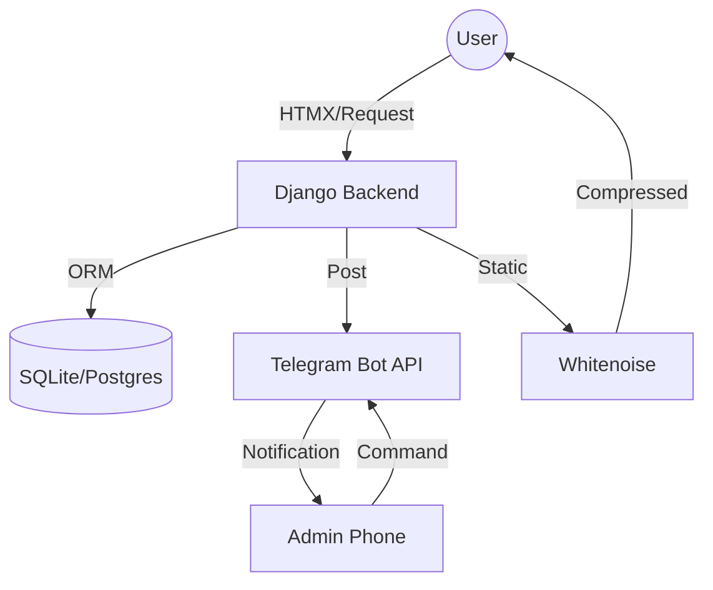

# Zeniti: High-Precision Full-Stack Portfolio 🚀

[](https://www.djangoproject.com/)
[](https://zeniti.tech)
[](LICENSE)

**Zeniti** is a professional-grade, B2B-focused developer portfolio and service ecosystem. It combines a striking "Cyber-Hacker" aesthetic with robust automation, real-time notifications, and high-precision UI/UX design.

---

## 💎 Project Highlights

- **🎭 Dual-Theme System:** Dynamic toggle between *Default (Sleek Dark)* and *Hacker (Matrix-Glow)* modes.
- **📅 Smart Booking:** Native appointment calendar with real-time availability validation.
- **📊 Scope Estimator:** Interactive tool for clients to calculate project timelines and budgets.
- **🤖 Telegram Integration:** Real-time lead notifications and appointment management via safe-string Telegram Bot API.
- **🔒 Security First:** Invisible Honeypot anti-spam, CSRF protection, and strictly validated i18n localization.
- **⚡ Performance:** Optimized with HTMX for partial page updates and Whitenoise for high-speed static asset delivery.

---

## 🏗 System Architecture



---

## 🛠 Tech Stack

- **Backend:** Python 3.13 + Django 4.2 (LTS)
- **Frontend:** HTML5, CSS3 (Glassmorphism), Vanilla JavaScript, [HTMX](https://htmx.org/)
- **API:** Telegram Bot API
- **Testing:** Django TestCase + Unittest (Mocking)
- **i18n:** Built-in Django Internationalization (EN/KA)

---

## 🚀 Getting Started

### Prerequisites
- Python 3.10+
- Pipenv or venv

### Installation

1. **Clone & Navigate:**
   ```bash
   git clone https://github.com/achiko10/achiko7.git
   cd achiko7
   ```

2. **Environment Setup:**
   ```bash
   python -m venv venv
   source venv/bin/activate # Windows: venv\Scripts\activate
   pip install -r requirements.txt
   ```

3. **Environment Variables (`.env`):**
   ```env
   DJANGO_SECRET_KEY=your_key
   DJANGO_DEBUG=True
   TELEGRAM_BOT_TOKEN=your_token
   TELEGRAM_CHAT_ID=your_id
   ```

4. **Initialize & Run:**
   ```bash
   python manage.py migrate
   python manage.py test portfolio.tests # Run the professional test suite
   python manage.py runserver
   ```

---

## 🧪 Testing
Professional integrity is maintained through a robust test suite covering:
- **Models:** Data integrity and unique constraints.
- **Views:** Route accessibility and template rendering.
- **Integrations:** Mocked Telegram API calls to ensure zero-failure deployments.

Run tests: `python manage.py test`

---

## 📄 License
This project is licensed under the **MIT License** - see the [LICENSE](LICENSE) file for details.

---

*Engineered with precision by [achiko10]*
